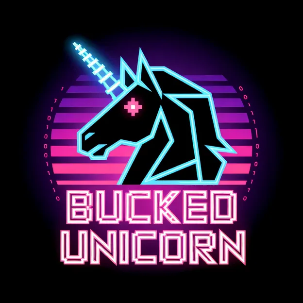

  
  
  # BuckedUnicorn
  
  **Backend Infrastructure Engineer**  
  *Building systems that scale, securing by design, optimizing for reliability*

  
  
  

  

  

<em>Badges reflect representative scale I've operated; see "Recent Engineering Wins" for context.</em>

---

## What I Do

| 🏗️ **Infrastructure** | 🔐 **Security** | ⚡ **Performance** |
|---|---|---|
| Design distributed systems that gracefully handle failure modes, scale horizontally, and maintain strong consistency guarantees where needed. | Implement zero-trust architectures with defense-in-depth strategies, automated compliance, and incident response playbooks. | Optimize critical paths with profiling, caching strategies, and resource management to achieve sub-100ms response times. |

## 🎯 Engineering Philosophy

> *"Systems that can't be operated shouldn't be built. Security that isn't automated won't happen. Performance that isn't measured doesn't exist."*

<strong>🔧 Backend Patterns I Live By</strong>

| Pattern | Problem Solved | Impact |
|---------|----------------|--------|
| **Transactional Outbox** | Distributed transactions across services | Guaranteed event delivery |
| **Circuit Breaker + Timeout** | Cascading failures from flaky dependencies | Fast failure, system stability |
| **Idempotency Keys** | Duplicate requests, retry safety | Zero data corruption |
| **CQRS (Selective)** | Read/write performance mismatches | 10x read optimization |
| **Saga Pattern** | Long-running business processes | Reliable compensation |

<strong>🚀 DevOps Practices That Ship</strong>

### 🔄 CI/CD Pipeline
- Build → Test → SBOM → Scan → Sign
- OIDC to cloud (zero long-lived secrets)
- Progressive deployment with rollback
- Automated compliance validation

### 📊 Observability Stack
- Distributed tracing with correlation IDs
- RED + USE metrics dashboards
- SLO/SLI with error budgets
- Automated alerting with runbooks

### 🏗️ Infrastructure
- Terraform with policy gates
- Immutable infrastructure
- Auto-scaling with cost optimization
- Multi-region disaster recovery

### 🔐 Security Automation
- SAST/DAST in every pipeline
- Container image vulnerability scanning
- Secret rotation and management
- Compliance as code (SOC2/GDPR)

<strong>💡 Recent Engineering Wins</strong>

- **Microservices Migration:** Decomposed monolith to 15 services with zero-downtime deployment pipeline
- **Security Hardening:** Implemented zero-trust architecture with automated policy enforcement
- **Performance Optimization:** Reduced P99 latency from 2.3s to 180ms through caching and query optimization
- **Cost Engineering:** Right-sized infrastructure and implemented intelligent auto-scaling, saving $200K annually

## 🛠️ Technology Arsenal

<table>
<tr>
<td>

**⚡ Core Languages**

</td>
<td>

**🗄️ Data & Messaging**

</td>
</tr>
<tr>
<td>

**☁️ Cloud & Infrastructure**

</td>
<td>

**🔐 Security & Observability**

</td>
</tr>
</table>

<em>Stack chosen for production reliability, not resume padding</em>

## 🎖️ Current Focus & Exploration

| 🔥 **Production Work** | 🧪 **Learning & Experiments** |
|---|---|
| • Building event-driven microservices with Go + NATS • Implementing policy-as-code security with OPA/Rego • Optimizing Postgres for high-throughput analytical queries • Designing multi-region disaster recovery architectures | • Rust for embedded systems and WebAssembly • eBPF for observability and security monitoring • Istio service mesh for zero-trust networking • WASM-based serverless runtime architectures |

## 📈 GitHub Activity

<strong>View activity cards</strong>

  
  
  
   
  
  
  
<em>These cards are generated by external services; if they appear broken, try refreshing.</em>

## 🤝 Let's Connect

  

